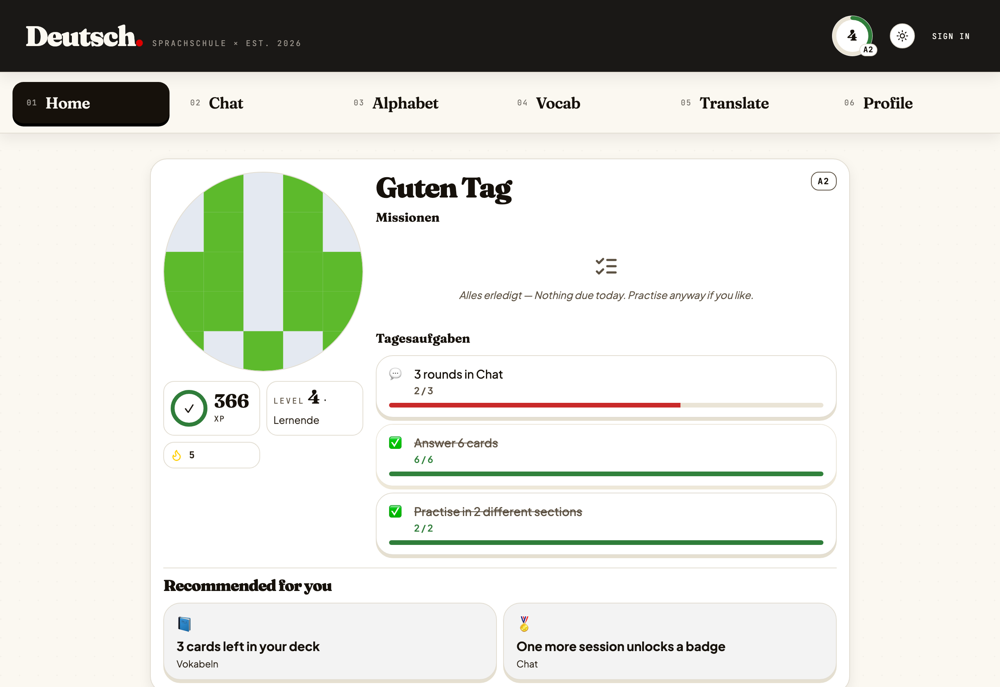
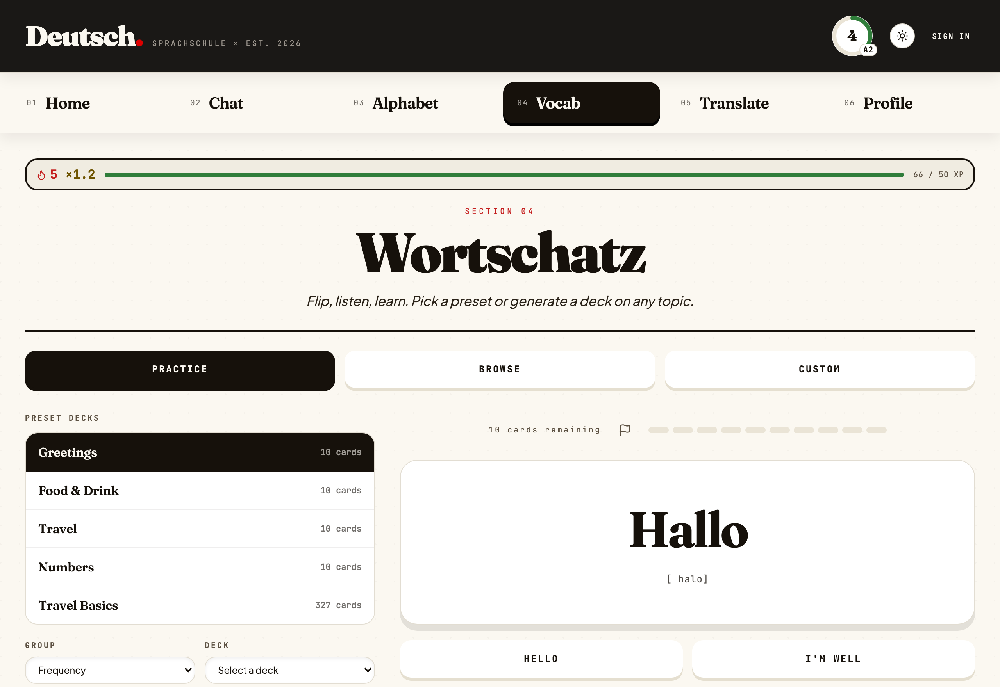
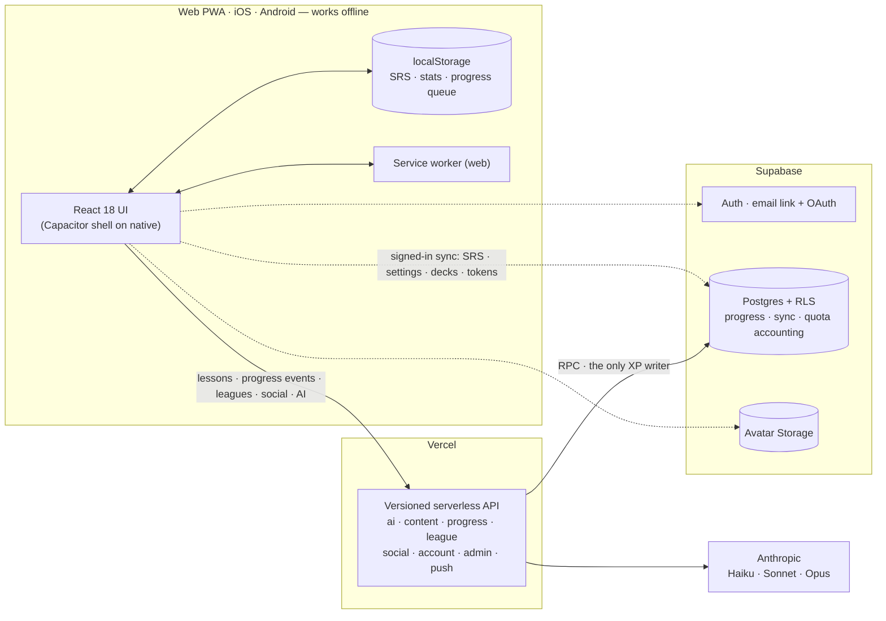

<div align="center">

<sup>SPRACHSCHULE · BUILT FOR CURIOUS MINDS</sup>

# Deutsch· — German practice with engineering depth

**An offline-first German-learning app — on the web and as native iOS and
Android builds — that blends focused practice, deterministic gamification,
secure cross-device sync, and AI where it genuinely helps.**

[](https://www.sprachschule-app.com)
[](https://github.com/blackhebrewisraeli/Sprachschule-app/actions/workflows/ci.yml)
[](https://react.dev/)
[](https://vite.dev/)
[](https://capacitorjs.com/)
[](https://supabase.com/)
[](https://vercel.com/)
[](./LICENSE)

[Try the app](https://www.sprachschule-app.com) ·
[Run it locally](#-quick-start) ·
[See the architecture](#-system-at-a-glance) ·
[Read the wiki](https://github.com/blackhebrewisraeli/Sprachschule-app/wiki)



<sub>Six tabs, one codebase on three platforms, and considerably more thought about merge semantics than a language app has any right to contain.</sub>

</div>

> [!NOTE]
> **Accounts are optional.** Lessons, vocabulary, speech, SRS, progress,
> streaks, and quests all work locally, with no sign-up. Signing in
> (passwordless: an email code or link, Google, GitHub, and Apple where the
> provider is enabled) adds cross-device sync, weekly leagues, a followable
> profile, and quest tokens; generative features require the server API.

## ✨ What learners get

| Experience                                  | What it does                                                                                                                                                   |
| ------------------------------------------- | -------------------------------------------------------------------------------------------------------------------------------------------------------------- |
| 💬 **Scene-based conversation**             | The AI opens a scene in character — a barista, an airport check-in agent — caps sentence length by CEFR level, and corrects you inline.                        |
| 🪜 **Scaffolding that fades**               | Chat and Translate share one input ladder: word bank, choose the word, type the word, free typing. Start where your level puts you; switch anytime.            |
| 🧠 **Vocabulary & SRS**                     | Leitner review over preset, lexicon, grammar-drill, interest-topic, and custom AI-generated decks, plus a Travel Basics phrasebook.                            |
| 🔤 **Alphabet & listening**                 | German speech synthesis, confusable-letter quizzes, and a browsable pronunciation grid.                                                                        |
| 🧭 **Optional placement**                   | Start at A1 straight away, or take nine offline questions to place at A1, A2, or B1. The app suggests it again at 500 XP.                                      |
| 🎮 **Motivation that respects the learner** | XP, streak freezes, earned-only badges, daily quests that pay tokens, and optional weekly leagues.                                                             |
| 👥 **Social, opt-in**                       | Pick a handle, find people, follow them, and choose whether your profile is public or private.                                                                 |
| 🤖 **Cost-aware AI routing**                | Fast, Balanced, and Capable profiles sit behind server-enforced access ceilings and daily usage accounting; guest and Free requests currently resolve to Fast. |

|                          Vocabulary practice                          |
| :-------------------------------------------------------------------: |
|  |

## 🦸 Two things that make it unusual

<details open>
<summary><strong>🔌 Offline-first sync that understands different kinds of data</strong></summary>

The device's `localStorage` is the offline authority; Supabase is an optional
cross-device layer. Reconciliation happens client-side, so each state slice
gets semantics that fit its data instead of one risky "newest blob wins" rule.

| State slice                  | Merge strategy                                 | Why                                                                                                 |
| ---------------------------- | ---------------------------------------------- | --------------------------------------------------------------------------------------------------- |
| Daily stats & XP             | **Server-owned event log**                     | Each answer queues locally with its own ID; one idempotent RPC applies it. The client never writes. |
| SRS cards                    | **Per-card LWW** on `lastReviewed`             | Reviewing one card should not overwrite another card's state.                                       |
| Settings                     | **Whole-record LWW**, with explicit carve-outs | Ordinary preferences share a clock; special data does not.                                          |
| CEFR level                   | **Independent LWW clock**                      | A newer unrelated setting cannot roll B1 back to A1.                                                |
| Learned words & deck mastery | **Union merge**                                | Learning on either device remains learned.                                                          |
| Custom decks                 | **Per-deck LWW + tombstones**                  | Offline deletion competes with edits by timestamp instead of resurrecting removed decks.            |

Daily stats are the strictest case. Every XP reader — streaks, lifetime XP,
league standings — sums one table, so clients may read it but never write it.
Offline answers wait in a durable queue; on reconcile the client rebuilds each
day as _server rows + unflushed queue_, so an answer is neither lost nor
counted twice, and a browser cannot mint XP.

Deck deletion is the other interesting edge case. An upsert-only system cannot
express absence, so a stale device would recreate a deleted deck. Deutsch·
keeps a timestamped tombstone; the same per-deck LWW comparison then decides
whether an edit or deletion is newer.

→ [Offline-First Sync Model](https://github.com/blackhebrewisraeli/Sprachschule-app/wiki/Offline-First-Sync-Model) in the wiki.

</details>

<details>
<summary><strong>🎯 Daily quests with deterministic variety and zero quest rows</strong></summary>

Three daily quests are derived—not stored—from a stable seed:

```js
seed = seedFor(userId, todayKey); // hash(`${userId ?? 'guest'}:${todayKey}`)
quests = pickQuests(QUEST_CATALOGUE, seed, 3);
progress = readExistingDailyCounters(todayKey);
```

The same learner gets the same quests all day, on every device, even offline.
There is no quest table to maintain, synchronize, or accidentally reshuffle.

Difficulty adapts without chasing outliers. Targets use the **median of the
previous seven days**, excluding today, then apply per-quest multipliers. A
single heroic study binge cannot make tomorrow miserable, and today's progress
cannot move today's goalposts.

A finished quest pays **tokens, never XP**. The balance is a server-side
ledger: the `award_tokens` RPC picks the amount, caps it per day, and is
idempotent on `(reason, key)` with the key `todayKey:questId` — so a quest pays
once, however many devices claim it. League XP stays tied to actual graded
practice.

</details>

## 🧭 System at a glance



> Learner-progress merges stay in pure client-side functions — deterministic,
> testable, and usable before the network returns. Every XP-bearing write goes
> through one Postgres RPC behind `POST /api/v1/progress/events`, so the
> database has exactly one writer for the numbers leagues are decided on.

## ⚡ Quick start

**Prerequisites:** Node.js 22 (see `.nvmrc`) and npm.

```bash
git clone https://github.com/blackhebrewisraeli/Sprachschule-app.git
cd Sprachschule-app
npm install --legacy-peer-deps
npm run dev
```

Open [http://localhost:5173](http://localhost:5173). The offline-first learning
flows work with no Supabase, Vercel, or Anthropic credentials at all.

| Command                       | Purpose                                                      |
| ----------------------------- | ------------------------------------------------------------ |
| `npm run dev`                 | Start the Vite UI                                            |
| `npm run dev:full`            | Start Vite plus the Vercel functions (AI, leagues, social)   |
| `npm test`                    | Run the main Vitest suite                                    |
| `npm run lint`                | Run ESLint                                                   |
| `npm run format:check`        | Check Prettier formatting                                    |
| `npm run test:rls`            | Run the RLS policy suite (needs Docker + `supabase start`)   |
| `npm run build:mobile`        | Build against production and sync into `ios/` and `android/` |
| `npm run smoke:learning-path` | Browser smoke test for the anonymous core learning loop      |
| `npm run screenshots:capture` | Capture and validate native store artwork                    |

Accounts, sync, leagues, avatars, and the AI endpoints each need a little more
setup — local Supabase via Docker, a few `VITE_*` flags, and an
`ANTHROPIC_API_KEY`. The full matrix, every npm script, and the usual
"why is sync doing nothing locally?" answer live in
**[Local Development](https://github.com/blackhebrewisraeli/Sprachschule-app/wiki/Local-Development)**.

### 📱 Native apps

`ios/` and `android/` are committed Capacitor 8 projects that wrap the same web
bundle. Every push to `main` builds an iOS simulator app and an Android debug
APK in CI. Native release builds pin the production API and Supabase project,
enable sync, leagues, Google, GitHub, and Apple sign-in, and deliberately keep
push, ads, and saved tutor history dark until their release runbooks are
complete. The source is at version 1.0.1, build 7; what has actually been
uploaded to TestFlight or Google Play is tracked separately, in the release
status at the top of
[`docs/STORE_SUBMISSION_CHECKLIST.md`](./docs/STORE_SUBMISSION_CHECKLIST.md).
For signed builds, auth deep links, and store copy, see
[`docs/NATIVE_BUILD.md`](./docs/NATIVE_BUILD.md),
[`docs/MOBILE_AUTH_SETUP.md`](./docs/MOBILE_AUTH_SETUP.md), and
[`docs/store-metadata/`](./docs/store-metadata/).

## 📚 Where to learn more

Deep documentation lives in the **[project wiki](https://github.com/blackhebrewisraeli/Sprachschule-app/wiki)**.

| Page                                                                                                                       | What's there                                                    |
| -------------------------------------------------------------------------------------------------------------------------- | --------------------------------------------------------------- |
| [Architecture Overview](https://github.com/blackhebrewisraeli/Sprachschule-app/wiki/Architecture-Overview)                 | The two-lane design, tech stack, and repository map             |
| [Offline-First Sync Model](https://github.com/blackhebrewisraeli/Sprachschule-app/wiki/Offline-First-Sync-Model)           | Merge semantics, tombstones, and independent LWW clocks         |
| [Lesson Engine](https://github.com/blackhebrewisraeli/Sprachschule-app/wiki/Lesson-Engine)                                 | Data-driven lessons, the exercise registry, and progress events |
| [Security & Role Architecture](https://github.com/blackhebrewisraeli/Sprachschule-app/wiki/Security-and-Role-Architecture) | Key boundaries, RLS, the AI boundary, and the avatar pipeline   |
| [Operations Runbooks](https://github.com/blackhebrewisraeli/Sprachschule-app/wiki/Operations-Runbooks)                     | OAuth, email templates, migrations, and the production drill    |
| [Local Development](https://github.com/blackhebrewisraeli/Sprachschule-app/wiki/Local-Development)                         | Full setup, every npm script, and troubleshooting               |
| [Contributing & Quality](https://github.com/blackhebrewisraeli/Sprachschule-app/wiki/Contributing-and-Quality)             | Testing philosophy, conventions, and the PR flow                |

Versioned material stays in the repository, where it is reviewed alongside the
code it describes: API contracts in [`docs/api/`](./docs/api/), design specs
and implementation plans in [`docs/superpowers/`](./docs/superpowers/), and
deliberately deferred work in [`docs/BACKLOG.md`](./docs/BACKLOG.md).

## 🤝 Contributing

Bug reports, accessibility findings, architecture questions, and focused pull
requests are all welcome. Please read [`AGENTS.md`](./AGENTS.md) first — it is
the single source of truth for this project's conventions and product
boundaries — and [Contributing & Quality](https://github.com/blackhebrewisraeli/Sprachschule-app/wiki/Contributing-and-Quality)
for the testing philosophy behind them.

## 📄 License

Released under the [MIT License](./LICENSE). Vocabulary sources — Wiktionary,
Tatoeba, the Leipzig Corpora Collection, and the Wikivoyage phrasebook — and
their attribution are documented in [`CONTENT_LICENSE.md`](./CONTENT_LICENSE.md).

<div align="center">

**Built to help people learn German—and to make the hard parts of frontend
engineering visible.**

[Launch Deutsch·](https://www.sprachschule-app.com) ·
[Back to top](#deutsch--german-practice-with-engineering-depth)

</div>
